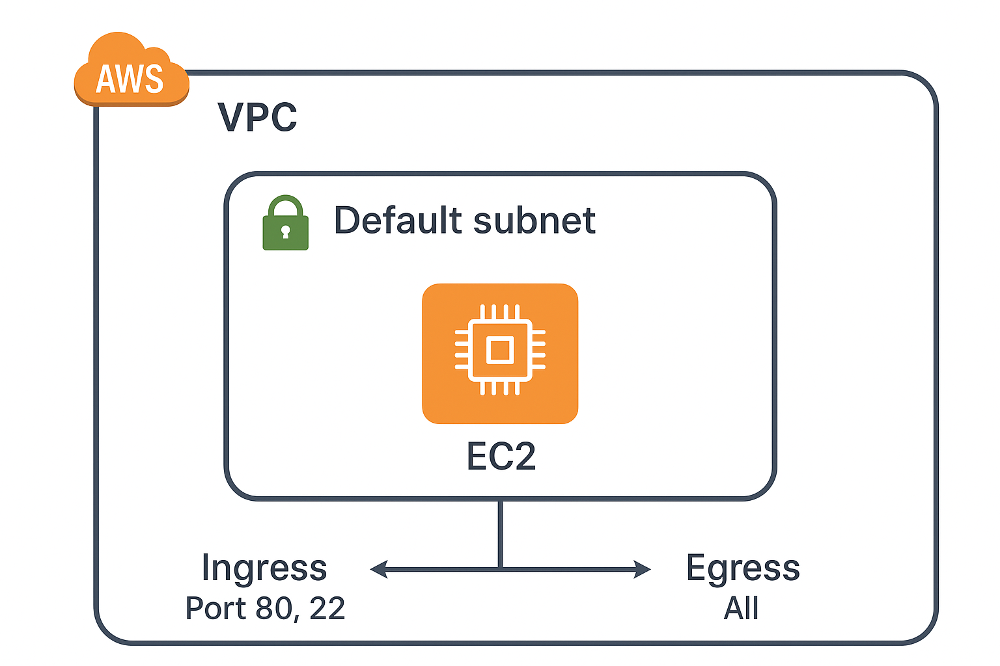
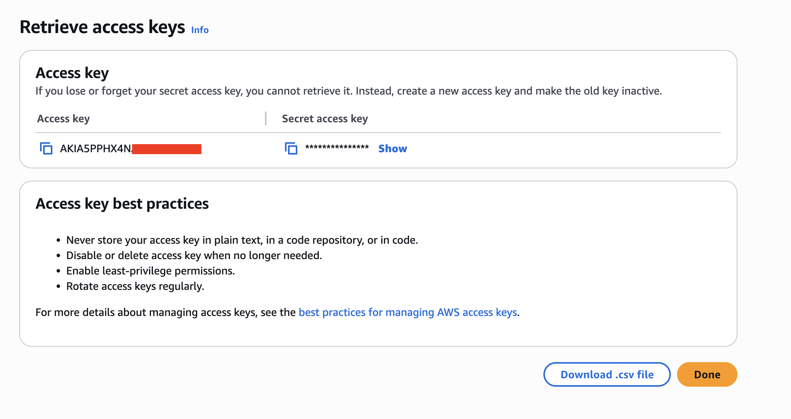
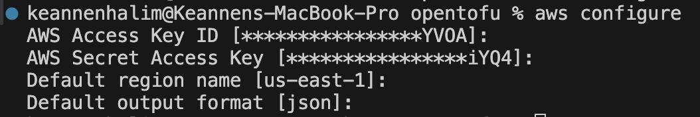
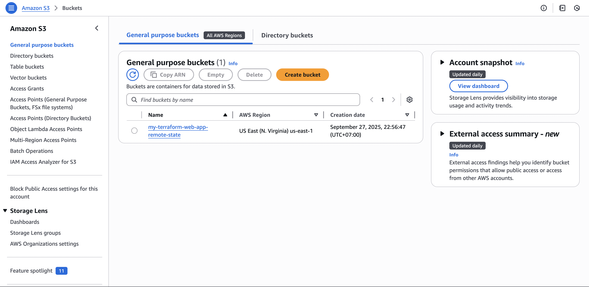
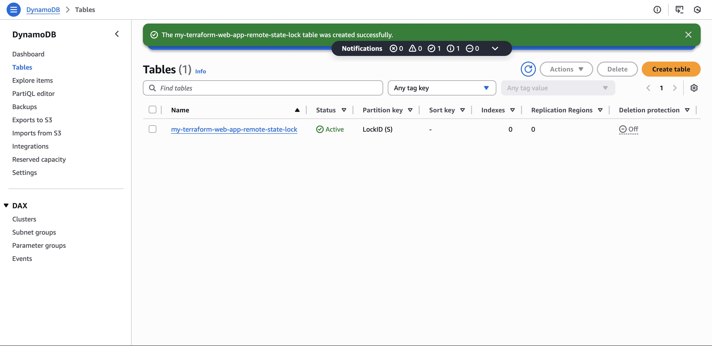
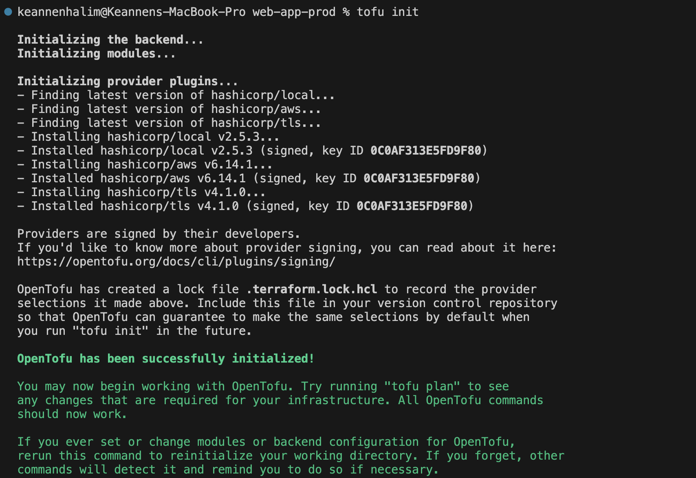
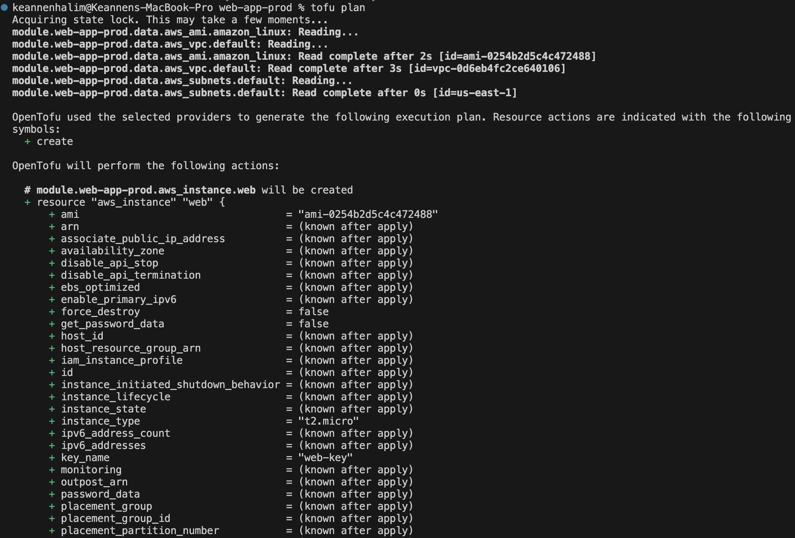
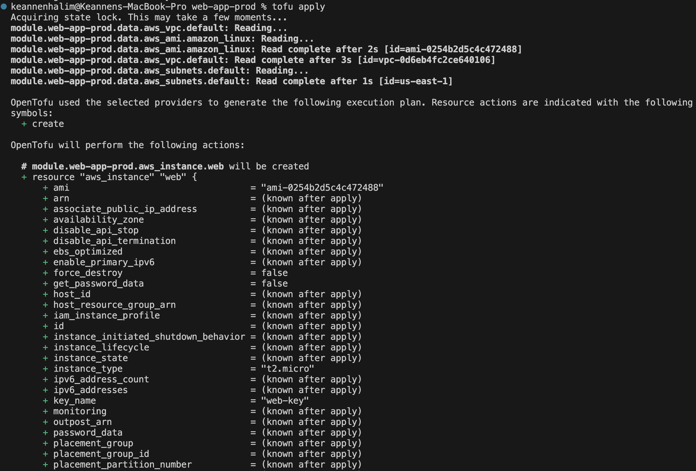
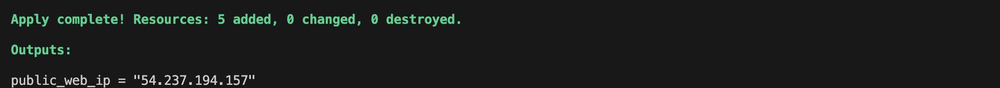
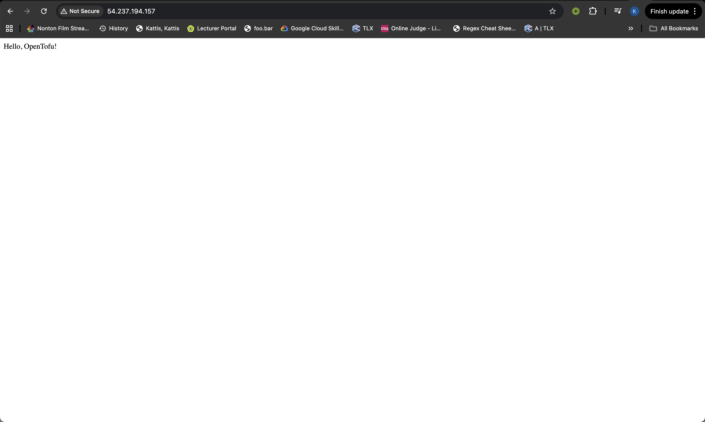

# Terraform / OpenTofu Example Project
This repository is created for the purpose of demonstrating the use of Terraform / OpenTofu to provisioned an infrastructure, usually known as Infrastructure as Code (IaC).

I created this by utilizing the **remote state backend** feature that the Terraform / OpenTofu provided. I also make use of the **Terraform module** to make the code mode reusable.

## Infrastructure Diagram
In this example, I only make a simple EC2 instance, with the default VPC and the default subnets.



## Getting Started
This code is developed for provisioning an AWS infrastructure, so in other words, you have to have an AWS account. Please remember to change to the working directory before executing the tofu commands.

### Installing OpenTofu
You can see the official documentation for installing the OpenTofu from their official website. Visit [OpenTofu Website](https://opentofu.org/docs/intro/install/) for more details.

### Installing AWS CLI
You can see the official documentation for installing the AWS CLI from their official website. Visit [AWS Website](https://docs.aws.amazon.com/cli/latest/userguide/getting-started-install.html) for more details.

### Configuring AWS CLI
You have to setup an IAM user first, then setup an access key for that user. Please copy and store the access key securely because we have cannot retrieve it later after we close the page.



After creating the access key, run the following lines in a terminal:
```
aws configure
```
Then copy and paste the access key. Set the default region to the region that you want, in my case, I set it to us-east-1. Then also set the output format to json.



### Create an S3 Bucket
Create an S3 bucket with the desired name. My S3 bucket name is **my-terraform-web-app-remote-state**. If you use a different name, please change the bucket name in the terraform.tf file.



### Create DynamoDB Table
Create a DynamoDB table with the desired name. My DynamoDB table name is **my-terraform-web-app-remote-state-lock**. If you use a different name, please change the DynamoDB table name in the terraform.tf file. Make sure that the **partition key is set to LockID**, otherwise it cannot be used for state locking.



### Initialize The Backend and The Providers
Run the following lines in a terminal:
```
tofu init
```
This command will initialize the remote backend and installing the required providers.



### Provision The Infrastructure
To see the plan that will be executed, run the following lines in a terminal:
```
tofu plan
```



Finally, when we want to create and provisioned the infrastructure, run the following lines in a terminal:
```
tofu apply
```



### Check If the Apply Works
After running the tofu apply command, it will then output two things, first is the .pem key that is stored in the .ssh home directory and the second is the public ip for the web server that is shown on the terminal. 



Run the following lines in a terminal to check if the web server is working:
```
curl http://<IP ADDRESS>
```
Or you can open the address using browser. You will see the result like shown below.



### Taking Down The Infra
If we want to destroy and delete all the infrastructure that we've already provisioned, we can run the following lines in a terminal:
```
tofu destroy
```

## Reasons and Explanations
- I'm making use of the module to make the code more reusable
- I'm adding variables for the env, instance type, and the region so that the module can be used to provision multiple infrastructure in different environment, like dev or prod by using the same module.
- I'm storing the .pem key to the .ssh directory so that if we need to ssh to the instance, we can do that by using the key.